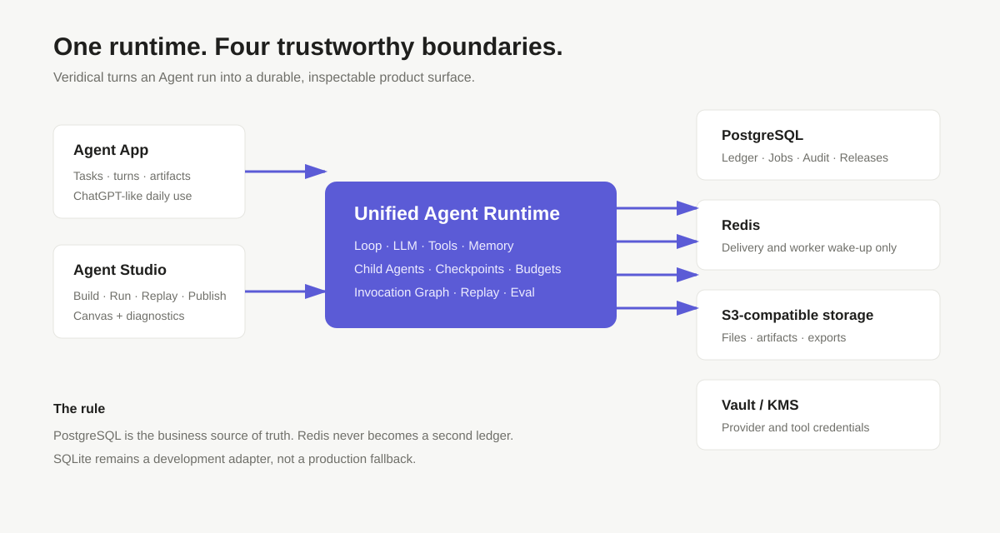
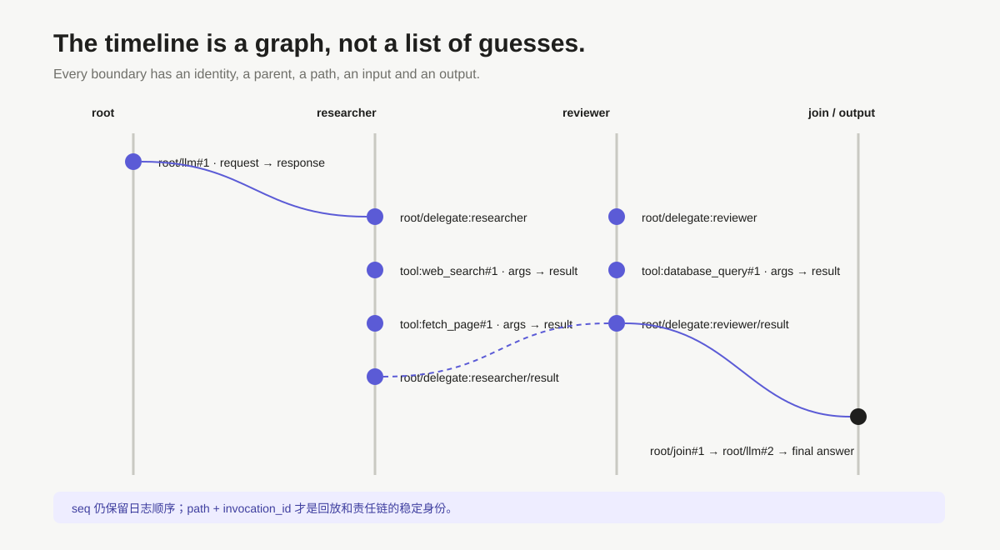
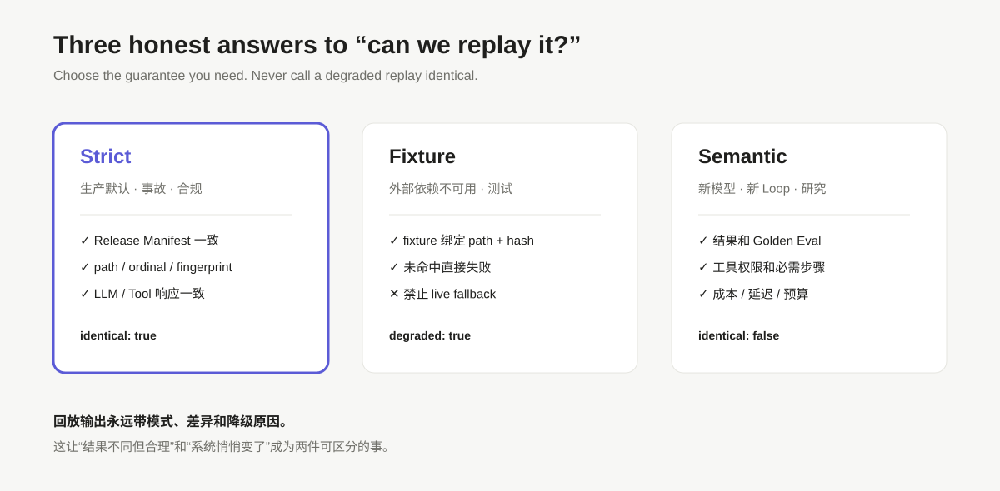
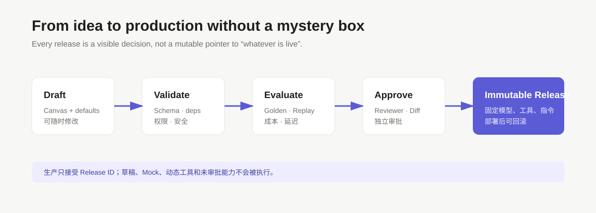

# Veridical

> **让 Agent 的每一步，都能被解释、被重放、被改进。**

Veridical 不是一个“把 prompt 发给模型”的薄壳。它更像 Agent 的飞行记录器、审计账本和测试实验室：主 Agent 调用了谁、子 Agent 做了什么、工具收到了什么参数、模型看到了哪些上下文、最终为什么停下——全部进入一条可验证的调用轨迹。

```text
用户任务
   │
   ▼
Agent Loop ──► LLM ──► Tool / MCP ──► Memory / Knowledge
   │                                      │
   └──────────── Invocation Graph ◄───────┘
                         │
             Replay / Eval / GRPO Export
```

## 它解决的不是“能不能回答”，而是“回答之后怎么办”

生产 Agent 最难的部分通常不是第一次调用模型，而是：

- 出错时，能不能知道是哪一次调用出了问题？
- 子 Agent 和工具之间的真实路径，能不能完整还原？
- 新模型上线后，行为变化能不能被发现，而不是在线上才被用户发现？
- 一个实验结果，能不能变成下一轮评测和 RL 训练的数据？
- 发布的到底是哪一版指令、工具、模型和权限？

Veridical 把这些问题收敛成同一条链：

```text
完整 in/out
   → 显式 Invocation Graph
   → Strict / Fixture / Semantic Replay
   → Golden / 成本 / 权限回归
   → GRPO / RL 轨迹导出
   → 可审批、可部署的 Release
```



## 你会看到什么

### Agent App

像使用 ChatGPT 一样使用 Agent：任务、多轮对话、流式回复、产物和运行详情都围绕同一个 Task 展开。

### Agent Studio

画布是构建和诊断入口，而不是用户必须理解的配置文件。默认路径只有：

```text
Input → Agent → Output
          ↑
 Tool / Skill / Memory
```

Agent 节点内部管理模型、Loop、工具、Skill、Memory、预算和审批策略；普通场景不需要额外连接一个模型节点。

### 运行详情

```text
主 Agent
├─ LLM #1
├─ 子 Agent：researcher
│  ├─ LLM #1
│  ├─ Tool：web_search #1
│  ├─ Tool：fetch_page #1
│  └─ Result
├─ Join #1
└─ LLM #2
```

每个节点都有 `path`、`parent_invocation_id`、`ordinal`、`attempt`、fingerprint、脱敏输入输出、耗时、Token、成本和 Artifact 版本。



## 三种回放，不把“不同”伪装成“相同”

| 模式 | 用途 | 规则 |
| --- | --- | --- |
| **Strict** | 事故分析、合规、发布门禁 | Release、路径、参数、响应和事件结构必须一致 |
| **Fixture** | 外部依赖不可恢复 | 只允许声明过的固定 fixture，禁止偷偷访问 live 服务 |
| **Semantic** | 新模型、新 Loop、研究策略 | 允许路径变化，但必须通过结果、权限、质量、成本和步骤门禁 |

Strict Replay 的结果明确回答：

```json
{ "mode": "strict", "identical": true, "degraded": false }
```

如果无法严格回放，Veridical 会报告降级原因，不会把近似结果包装成 identical。



## 生产架构

```text
PostgreSQL
├─ Ledger / Invocation Graph / Audit
├─ Job / Lease / Fencing
├─ Artifact / Release / Pointer
└─ Replay / GRPO 数据源

Redis  ── 任务投递和唤醒（不是业务事实源）
S3    ── 文件、知识库文件、Artifact 和导出物
Vault ── Provider、MCP 和工具凭据
SQLite ── 仅开发与自动化测试
```

生产配置会 fail-closed：不能用 SQLite、local object store 或 in-process queue 冒充生产环境。

## 快速开始

要求 Node.js `>=22.14.0` 和 pnpm：

```bash
pnpm install
pnpm dev
```

打开 <http://127.0.0.1:5177>。

本地模型配置放在仓库根目录 `.env.local`，该文件不会提交：

```dotenv
VERIDICAL_LLM_BASE_URL=https://your-provider.example/v1
VERIDICAL_PROVIDER_KEY=your-secret
VERIDICAL_LLM_MODEL=your-model
VERIDICAL_LLM_MAX_OUTPUT_TOKENS=512
VERIDICAL_LLM_ENABLE_THINKING=false
```

浏览器只看到 Provider、模型和连接状态，永远不会收到 API Key。

## 生产依赖与真实验收

启动本地 PostgreSQL、Redis 和 MinIO：

```bash
pnpm infra:up
pnpm infra:status
```

运行真实业务链（Spec → Suite → Evaluation → Approval → Deploy → Run）：

```bash
pnpm test:production:postgres
```

运行 Qwen 真实模型链路。它是显式 opt-in，因为会产生真实模型调用费用：

```bash
VERIDICAL_RUN_LIVE_E2E=1 \
VERIDICAL_LIVE_E2E_RUNS=5 \
pnpm -F @veridical/server test:production:live
```

测试会从 `.env.local` 读取 Qwen 配置，并验证 PostgreSQL、Redis、S3、发布、评估和多次运行。

## SQLite → PostgreSQL 迁移

迁移是一次性、可校验、可回滚的事务操作，覆盖 Session、Event、Artifact、Job、Pointer、Token 和限流记录：

```bash
VERIDICAL_SQLITE_PATH=/path/to/ledger.db \
VERIDICAL_POSTGRES_URL=postgres://... \
VERIDICAL_DATA_KEY=<64-hex> \
VERIDICAL_AUDIT_KEY=<64-hex> \
VERIDICAL_MIGRATION_REPORT=postgres-migration-report.json \
pnpm -F @veridical/server db:migrate:postgres
```

报告包含数量、租户、源数据 Hash、链完整性和失败原因。回滚必须引用已完成的 migration checkpoint：

```bash
VERIDICAL_MIGRATION_ID=<migration-id> \
VERIDICAL_SQLITE_PATH=/path/to/ledger.db \
VERIDICAL_POSTGRES_URL=postgres://... \
VERIDICAL_DATA_KEY=<64-hex> \
VERIDICAL_AUDIT_KEY=<64-hex> \
pnpm -F @veridical/server db:migrate:postgres -- --rollback
```

## 研究数据，不在平台里训练

Veridical 不托管训练权重，也不实现优化器。它负责把运行投影成稳定的学习样本：

```text
trajectory_id
run_id / turn_id / path
state → action → observation → next_state
tool_input / tool_output
reward / done
release_hash / event_refs
```

导出的 JSONL/GRPO 数据可以交给外部训练系统；同一运行重复导出时，样本 Hash 保持稳定。

## 常用命令

生产启动、迁移、回滚和故障处理请参阅：[生产运行手册](docs/production-runbook.md)。

```bash
pnpm test                         # 全 workspace 测试
pnpm build                        # 全 workspace 构建
pnpm test:regression              # 回归、构建和生产 smoke
pnpm test:infrastructure          # PostgreSQL / Redis / S3 基础设施 smoke
pnpm test:production:postgres     # 真实生产存储业务 E2E
pnpm -F @veridical/server test:production:live  # 显式授权的 Qwen E2E
```

## 仓库地图

```text
packages/schema   事件与调用记录模型
packages/store    追加式 Trace 存储
packages/runtime  Agent Loop、Recorder、Invocation Graph
packages/spec     Spec、Artifact、版本注册
packages/tools    ToolBroker 与权限控制
packages/llm      LLM Gateway、Mock、Provider
packages/replay   Replay Cursor、回放与轨迹投影
packages/eval     规则、Golden、模拟器评测
packages/server   研究 API、生产 API、Ledger、Worker、S3
packages/web      Agent App、Studio、Trace 与治理界面
```

## 最重要的一条边界

生产只执行已审批、不可变的 Release Artifact。草稿、Mock、动态工具、未审批 Skill/MCP、未固定模型和未声明的 live fallback，都不能进入生产运行。



**让 Agent 自己变强，可以；让生产版本未经审计地改变，不可以。**
